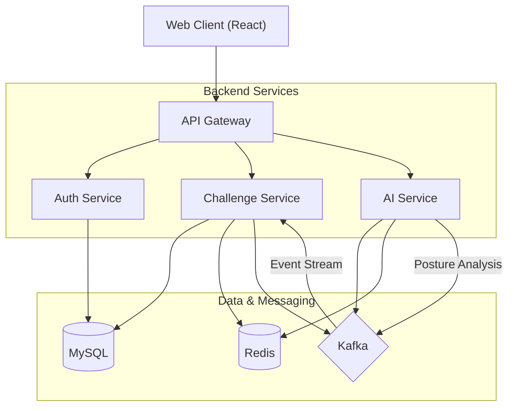

# AI-Based Real-time Posture Correction & Challenge System


AI 기반의 운동 루틴 기록 & 추천, 사용자 간 챌린지 시스템입니다. 마이크로서비스 아키텍처(MSA)를 기반으로 설계되었으며, 실시간 데이터 처리를 위해 Kafka를, 동시성 제어를 위해 Redis를 사용합니다.

## 🏗 Architecture

이 프로젝트는 **MSA (Microservices Architecture)** 패턴을 따르며, 모든 서비스는 Docker Container로 관리됩니다.



### Tech Stack
- **Frontend**: React.js
- **Backend**: Java (Spring Boot), Spring Cloud Gateway
- **AI Engine**: Python (Flask, MediaPipe/OpenCV)
- **Database**: MySQL 8.0
- **Cache & Concurrency**: Redis
- **Messaging**: Apache Kafka, Zookeeper
- **Infrastructure**: Docker, Docker Compose

---

## 📂 Project Structure

```text
fit-challenge-system/
├── .github/workflows/   # CI/CD Pipeline (GitHub Actions)
├── ai-service/          # Python AI Service (Pose Estimation)
├── backend/
│   ├── gateway-service/   # API Gateway
│   ├── auth-service/      # User Authentication
│   └── challenge-service/ # Business Logic
├── frontend/            # React Frontend Application
└── docker-compose.yml   # Main Infrastructure Orchestration
```

---

## 🚀 Getting Started

### Prerequisites
- [Docker](https://www.docker.com/products/docker-desktop/) & Docker Compose installed
- Git

### Installation & Running

1. **Clone the repository**
   ```bash
   git clone <repository-url>
   cd fit-challenge-system
   ```

2. **Start the System**
   Run the entire system with a single command. This will build all images and start the containers.
   ```bash
   docker-compose up --build
   ```

3. **Access the Application**
   - **Frontend**: [http://localhost:3000](http://localhost:3000)
   - **API Gateway**: [http://localhost:8080](http://localhost:8080)
   - **AI Service**: [http://localhost:5000](http://localhost:5000)

---

## 🔄 CI/CD Pipeline

이 프로젝트는 **GitHub Actions**를 사용하여 CI/CD를 자동화합니다.

### Workflow: `.github/workflows/ci-cd.yml`
- **Trigger**: `main` 브랜치에 Push 또는 Pull Request 발생 시 실행
- **CI (Continuous Integration)**:
  - `backend-build`: Spring Boot 서비스 (Gateway, Auth, Challenge) 빌드 및 테스트
  - `frontend-build`: React 앱 빌드
  - `ai-service-build`: Python 의존성 설치 및 검증
- **CD (Continuous Deployment)**:
  - 모든 테스트 통과 시 Docker 이미지를 빌드하여 **Docker Hub**로 Push
  - `latest` 태그 자동 적용

### 🔑 Required Secrets
이 워크플로우를 실행하려면 GitHub 저장소 설정(`Settings > Secrets and variables > Actions`)에 다음 변수를 추가해야 합니다.

| Secret Name | Description |
| :--- | :--- |
| `DOCKER_USERNAME` | Docker Hub 사용자 이름 |
| `DOCKER_PASSWORD` | Docker Hub 비밀번호 또는 Access Token |

---

## 📝 Service Details

### 1. Gateway Service (Port 8080)
- 모든 요청의 진입점
- 라우팅 정보:
  - `/auth/**` -> `auth-service`
  - `/challenges/**` -> `challenge-service`
  - `/ai/**` -> `ai-service`

### 2. Auth Service
- 사용자 회원가입, 로그인
- JWT 토큰 발급 및 검증 (예정)

### 3. Challenge Service
- 챌린지 생성 및 참여
- Redis를 활용한 참가자 수 동시성 제어
- Kafka 이벤트를 수신하여 실시간 점수 업데이트
