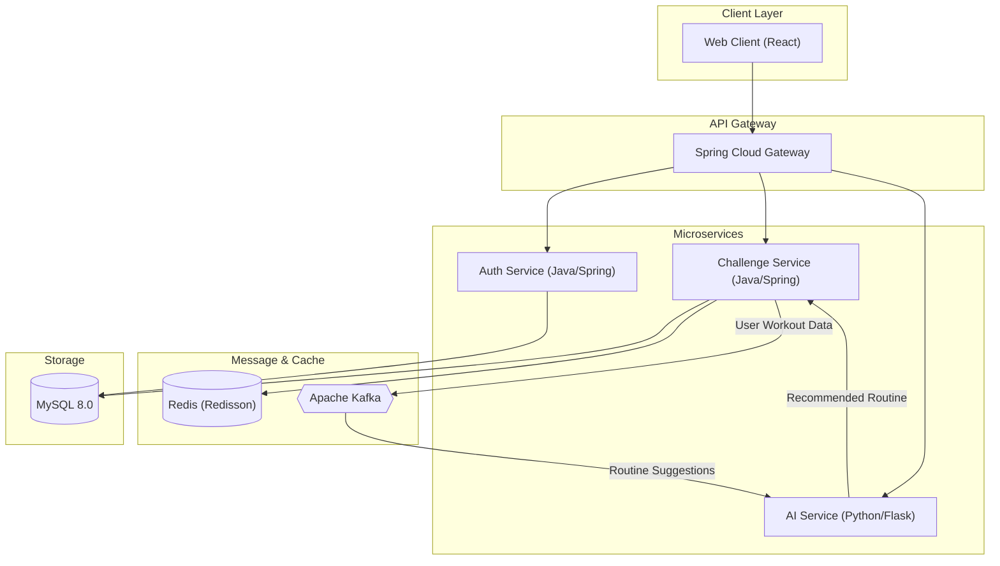

# AI 기반 운동 루틴 추천 및 챌린지 시스템 (Fit Challenge System)

본 프로젝트는 사용자의 운동 데이터를 분석하여 개인화된 **운동 루틴을 추천**하고, 이를 바탕으로 운동 기록 및 챌린지 참여를 지원하는 **마이크로서비스 아키텍처(MSA)** 기반의 시스템입니다.

■ 프로젝트 접속 주소: http://fitchallenge.duckdns.org:13000
■ 개발 상태: 진행 중

---

## 1. 사용 기술 스택 (Tech Stack)

### **Frontend**
- **React.js**: 사용자 인터페이스 및 운동 대시보드 구현
- **Nginx**: 프론트엔드 정적 파일 서빙 및 리버스 프록시

### **Backend (MSA)**
- **Java 17 / Spring Boot 3.2.0**: 핵심 비즈니스 로직 구현
- **Spring Cloud Gateway**: API 라우팅 및 통합 진입점 관리
- **Spring Data JPA**: 데이터 영속성 관리
- **Spring Security**: 사용자 인증 및 인가 제어

### **AI & Data Analysis (개발 중)**
- **Python (Flask)**: 운동 루틴 추천 알고리즘 API
- **Apache Kafka**: 사용자 운동 데이터와 백엔드 서비스 간의 비동기 이벤트 스트리밍

### **Storage & Concurrency**
- **MySQL 8.0**: 사용자 정보, 운동 기록, 챌린지 데이터 저장
- **Redis (Redisson)**: 분산 락(Distributed Lock)을 통한 선착순 챌린지 참여 및 포인트 업데이트 동시성 제어

### **Infrastructure / DevOps**
- **Docker & Docker Compose**: 컨테이너화 및 인프라 오케스트레이션
- **GitHub Actions**: CI/CD 파이프라인 자동화
- **Watchtower**: 도커 Hub 이미지 변경 감지 및 자동 배포

---

## 2. 아키텍처 도식화 및 설명

### **시스템 아키텍처**

### **아키텍처 설명**
1. **MSA 구조**: 각 서비스(인증, 챌린지, AI)를 독립적인 서비스로 분리하여 확장성과 유지보수성을 높였습니다.
2. **API Gateway**: `Spring Cloud Gateway`를 통해 모든 요청을 통합 관리하며, 서비스 간의 복잡한 라우팅을 추상화했습니다.
3. **이벤트 기반 아키텍처 (EDA)**: 사용자 운동 데이터 및 루틴 추천 정보는 `Kafka`를 통해 비동기적으로 교환됩니다. 이는 시스템 간 결합도를 낮추고 대량의 데이터를 안정적으로 처리합니다.
4. **동시성 제어**: `Redis`의 Redisson 분산 락을 활용하여 수천 명이 동시에 참여하는 챌린지나 포인트 적립 시 발생할 수 있는 데이터 정합성 문제를 해결했습니다.

---

## 3. CI/CD 기능 설명

본 프로젝트는 **GitHub Actions**와 **Docker Hub**, **Watchtower**를 조합하여 완전 자동화된 CI/CD 환경을 구축했습니다.

### **지속적 통합 (CI)**
- `main` 브랜치에 코드가 Push되거나 PR이 생성되면 워크플로우가 실행됩니다.
- **Backend**: Maven을 사용하여 각 서비스(Gateway, Auth, Challenge)를 빌드하고 JUnit 테스트를 수행합니다.
- **Frontend**: Node.js 환경에서 의존성 설치 및 리액트 빌드 과정을 검증합니다.
- **AI Service**: Python 의존성 및 코드 환경을 검증합니다.

### **지속적 배포 (CD)**
1. 모든 테스트와 빌드가 성공하면, Docker 이미지를 생성하여 **Docker Hub**에 `latest` 태그로 자동 Push합니다.
2. 운영 서버의 **Watchtower** 컨테이너가 Docker Hub의 이미지 변경을 실시간(30초 간격)으로 감시합니다.
3. 새로운 이미지가 감지되면, 실행 중인 컨테이너를 자동으로 중단시키고 최신 이미지로 재시작하여 다운타임을 최소화한 배포를 수행합니다.

---

## 4. 주요 기능 설명

### **1) AI 기반 운동 루틴 추천 (개발 진행 중)**
- 사용자의 나이, 성별, 신체 지표 및 과거 운동 기록을 분석합니다.
- 개인별 목표(체중 감량, 근력 향상 등)에 최적화된 맞춤형 운동 루틴을 생성하여 추천합니다.

### **2) 챌린지 시스템 (Challenge Service)**
- 다양한 운동 미션을 생성하고 사용자들이 참여할 수 있는 플랫폼을 제공합니다.
- **분산 락 적용**: 선착순 챌린지 참여 인원 제한 및 보상 지급 시 동시성 문제를 방지하여 신뢰성 있는 데이터를 유지합니다.

### **3) 운동 기록 및 통계 관리**
- 사용자가 수행한 운동 횟수와 시간을 체계적으로 기록합니다.
- 일별/주별 운동 통계를 대시보드 형태로 제공하여 사용자의 성취감을 고취시킵니다.

### **4) 온보딩 및 포인트 시스템 (Auth Service)**
- 사용자의 초기 신체 지표 및 운동 목표를 설정하는 온보딩 프로세스를 지원합니다.
- 운동 성과에 따라 포인트를 지급하며, 실시간 랭킹 시스템과 연동됩니다.
